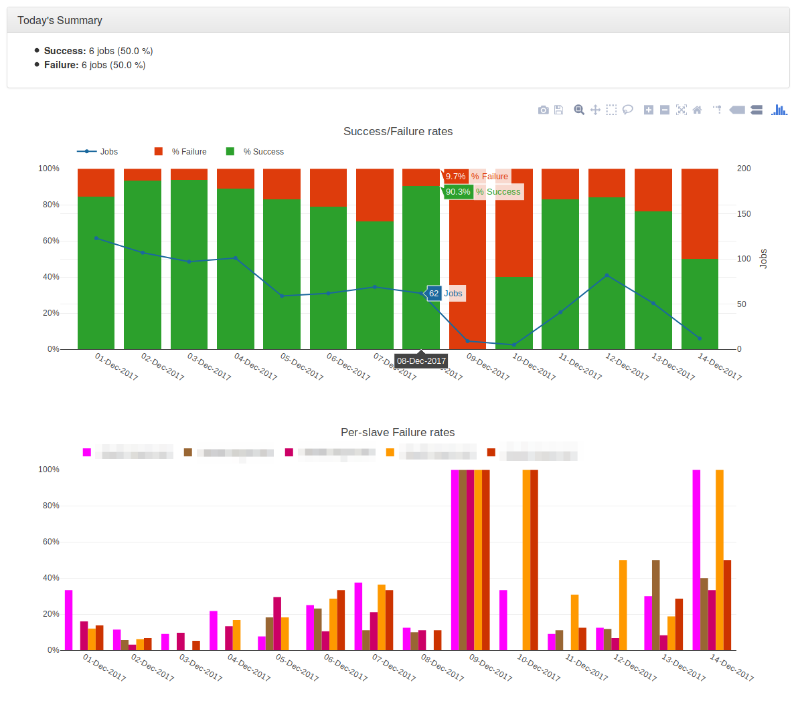
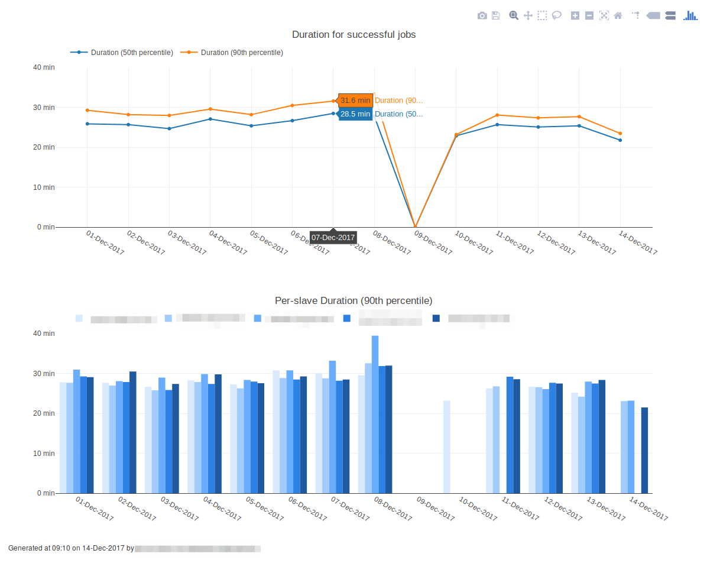

[](https://hub.docker.com/r/zingstats/zing-stats/)

&copy; Copyright 2017 Hewlett Packard Enterprise Development LP

# jenkins-stats

## Introduction

Tool for gathering job data from the Jenkins CI system (https://jenkins-ci.org/) and generating summary stat reports and graphs. These reports cover metrics such as success/failure rates and job duration.

Used initially for jobs triggered by OpenStack Zuul (https://docs.openstack.org/infra/zuul/) but should work with other Jenkins jobs too.

## Screenshots

Example output with overall and per-slave success/failure rates


Example output with overall and per-slave job durations



## Installation

### Using virtualenv

```
git clone <url to jenkins-stats repo>
sudo apt install virtualenv
virtualenv ~/venv/jenkins-stats
. ~/venv/jenkins-stats/bin/activate
pip install -r requirements.txt
```

## Running

### Running as script

```
./get_jenkins_stats.py -s <jenkins url> -j <jenkins job name> -o <output directory>
```

e.g.

```
./get_jenkins_stats.py -s https://www.example.net/jenkins/ -j my-jenkins-job -o /var/tmp/jenkins
Reporting on jobs between 10:55:06 30-Nov-2017 and 10:55:06 14-Dec-2017
/var/tmp/jenkins/my-jenkins-job.json not found, creating new data_file
Read 0 builds from /var/tmp/jenkins/my-jenkins-job.json
my-jenkins-job is a new job, querying all builds
Storing new record for build 1121
Storing new record for build 1122
Storing new record for build 1123
...
Wrote .html
Wrote /var/tmp/jenkins/my-jenkins-job.html

```

You can then view the report by opening /var/tmp/jenkins/my-jenkins-job.html in your browser.

### Running as container

#### Build container

- Set VERSION to the version you want to use for your image (https://semver.org/)
- build-args can be dropped if you're not afflicted by a proxy

```
export VERSION=0.0.2
docker build --build-arg version=${VERSION} --build-arg http_proxy=$http_proxy --build-arg https_proxy=$https_proxy -t zingstats/jenkins-stats:${VERSION} -t zingstats/jenkins-stats:latest .
```

#### Run container

```
docker run -v $(pwd)/output:/var/www/html/jenkins/stats -e JENKINS_URL=<jenkins url> -e JENKINS_JOB=<jenkins job name> zingstats/jenkins-stats:${VERSION}
```

## Testing

TODO (gasp!)

## Design

General strategy

1. Retrieve jenkins job data from Jenkins server.
2. Write data to a file in JSONL (https://en.wikipedia.org/wiki/JSON_Streaming#Line_delimited_JSON)
3. Load data into Pandas DataFrames
4. Resample to days or hours
5. Tabulate and plot

## Roadmap / Potential TODO

1. Add proper testing.
2. Move from JSONL to a db?
3. Split gathering and analysis into separate tools?

## License
This project is licensed under the Apache 2.0 license. Please see [LICENSE](LICENSE) for more info.

## Contributing and feature requests
**Contributing:** You know the drill. Fork it, branch it, change it, commit it, and pull-request it.
We are passionate about improving this project, and glad to accept help to make it better. However, keep the following in mind:

 - You must sign a Contributor License Agreement first. Contact one of the authors (from Hewlett Packard Enterprise) for details and the CLA.
 - We reserve the right to reject changes that we feel do not fit the scope of this project, so for feature additions, please open an issue to discuss your ideas before doing the work.

**Feature Requests:** If you have a need that is not met by the current implementation, please let us know (via a new issue).
This feedback is crucial for us to deliver a useful product. Do not assume we have already thought of everything, because we assure you that is not the case.


